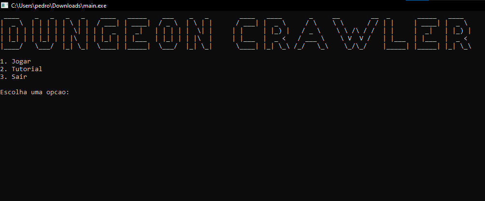

# 🏰 DUNGEON CRAWLER

> Um desafio épico em ASCII onde cada passo pode ser o último.

---

## 📖 Sobre o Jogo

Dungeon Crawler é um jogo desenvolvido em linguagem C para terminal/console, utilizando caracteres ASCII para representar todo o ambiente do jogo.

O jogador inicia sua jornada em uma pequena vila, onde deverá escolher uma arma para enfrentar os perigos que o aguardam dentro de uma antiga masmorra. Ao longo da aventura, será necessário resolver desafios, coletar chaves, abrir portas, derrotar monstros e sobreviver aos perigos de três andares cada vez mais difíceis até chegar ao confronto final contra o Boss.

---

## 👨‍💻 Desenvolvedores


* Ricardo Kenji Hidaka dos Reis - @RicardoKenjiHidakaReis
* Luiz Felipe Araújo dos Reis - @LuizFelipeAR
* Pedro Arthur Farias de Souza - @pedroarthurfsouza-cpu

---

## 🎮 História

### A Última Jornada do Herói

O Rei Demônio ameaça o reino mais uma vez.

Após uma longa jornada com sua equipe, o Herói Escolhido chegou à marmorra do inimigo. Seus companheiros ficaram para trás, e agora ele deve seguir sozinho.

O Herói precisa derrotar monstros para então...

No último andar, o Rei Demônio enfrentar.

Derrote-o e salve o reino!


---

## 🎯 Objetivo

* Explorar os andares da masmorra;
* Resolver os desafios de cada fase;
* Encontrar chaves e abrir portas;
* Derrotar monstros;
* Sobreviver utilizando suas 3 vidas;
* Derrotar o Boss Final para concluir a aventura.

---

## ⌨️ Controles

| Tecla | Ação                |
| ----- | ------------------- |
| W     | Mover para cima     |
| A     | Mover para esquerda |
| S     | Mover para baixo    |
| D     | Mover para direita  |
| I     | Interagir           |
| O     | Atacar              |

---

## ⚔️ Armas

### Espada

Ataque em área à frente do jogador.

### Arco e Flecha

Ataque em linha reta de longo alcance.

### Cajado

Ataque em todas as células adjacentes ao jogador.

---

## 🗺️ Legenda dos Símbolos

| Símbolo | Significado                   |
| ------- | ----------------------------- |
| `<`     | Jogador olhando para esquerda |
| `^`     | Jogador olhando para cima     |
| `>`     | Jogador olhando para direita  |
| `v`     | Jogador olhando para baixo    |
| `*`     | Parede                        |
| `#`     | Espinho                       |
| `k`     | Caixa destrutível             |
| `O`     | Botão                         |
| `D`     | Porta fechada                 |
| `@`     | Chave                         |
| `=`     | Porta aberta                  |
| `L`     | Escada                        |
| `X`     | Monstro Tipo 1                |
| `Y`     | Monstro Tipo 2                |
| `Z`     | Boss Final                    |

---

## ❤️ Sistema de Vidas

O jogador possui 3 vidas.

Ao ser atingido por um monstro ou passar por um espinho, perde uma vida e reinicia a fase atual.

Ao perder todas as vidas, o jogo retorna ao menu principal através da tela de Game Over.

---

## 📂 Estrutura do Projeto

```text
Dungeon-Crawler/
│
├── .vscode/
├── Jogo/
│   └── Arquivo executável do Jogo/
│       └── main.exe
└── README.md
```

---

## 🚀 Como Executar

Baixe o arquivo "main.exe" na pasta de Arquivo executavel do Jogo, habilite a permissão do windwos para aceitar autores desconhecidos e divirta-se!

---

## 📸 Capturas de Tela

### Screenshot do Jogo



---

## 🛠️ Tecnologias Utilizadas

* Linguagem C
* Git
* GitHub
* Terminal/Console
* Claude AI
* Chat GPT

---

## 🤖 Uso de Inteligência Artificial

Ferramentas de IA generativa foram utilizadas como apoio para:

* Esclarecimento de conceitos da linguagem C;
* Revisão de lógica de programação;
* Sugestões de organização do projeto;
* Auxílio na documentação do repositório.

### Todo o código implementado foi estudado, compreendido e adaptado pelos integrantes da equipe.

---

## 🏆 Diferenciais do Projeto

six seven?

---

## 📜 Licença

Projeto acadêmico desenvolvido para a disciplina de **Algoritimos e Codificações de Sistemas**, ministrada pelo professor **Pedro Girotto**.
